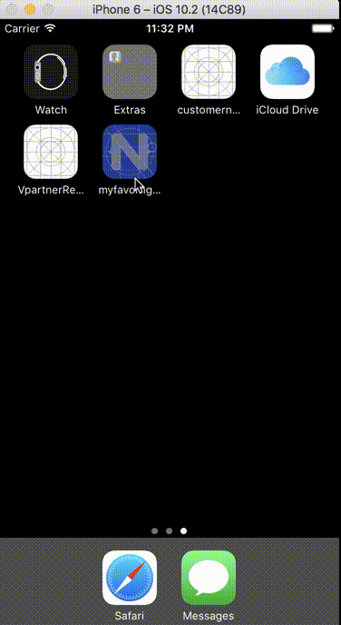

### myfavor.ru api + nativescript + angular2 



#### Features
[x] Offline storage
[x] Detect theme by day light
[x] Detect big or small screen
[x] Switch theme
[x] Handle network connection with retries
[x] Handle swipe directions
[x] Handle scroll position
[ ] Send push token
[ ] Receive push data

### Plugins
* Firebase
* Social share
* Toast messages

#### Test push token

* Copy firebase configs
```
google-services.json to app/App_Resources/Android/google-services.json
GoogleService-Info.plist to app/App_Resources/iOS/GoogleService-Info.plist
```

* Set variables in shell
```
SERVER_KEY=...
DEVICE_TOKEN=...
```

* Paste to shell
```
curl https://fcm.googleapis.com/fcm/send \
  -X POST \
  -H "Authorization: key=$SERVER_KEY" \
  -H "Content-Type: application/json" \
  -d '{"notification":{"title": "My title", "text": "My text", "sound": "default"}, "data":{"foo":"bar"}, "priority": "High", "to": "'$DEVICE_TOKEN'"}'
```
